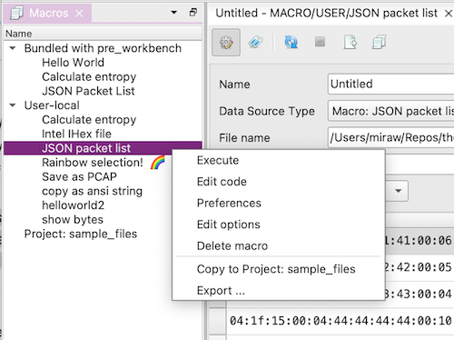

# Plugin and Macro Support

## Plugins
Plugin support is currently experimental and needs to be explicitly enabled.

You can load all *.py files from a folder as plugins, by setting a Plugin Directory in the settings dialog, 
or by running PRE Workbench with the `--plugins-dir=...` argument.

Plugins can e.g. register custom file types, dock widgets or selection heuristics.

The best way to develop plugins is to open your plugin directory as a PyCharm project and configure PyCharm to use
the virtualenv in which your PRE Workbench is installed. This way, you get full autocomplete support on internal objects.

* [Example Plugins](https://github.com/luelista/prewb_example_plugins)

## Macros

### Editing

To manage macros, use the *Macros* tool window (View > Tool Windows > Macros). There you can create, import, export, edit
and run your macros.

Macros can be stored in your user directory (~/.config / %APPDATA%) and in the project database (.pre_workbench).
Additionally, some example macros are bundled with the application.

You can also copy macros between the different storage locations (builtin, user, project).

Macros without a required input object (Input Type = NONE) can be directly run from the tool window by double-clicking.

### Security Model

**Macros run in-process, without any sandboxing - they have the same permissions as you running the app.** 
Therefore macros are TOFE (Trust On First Edit), so if you load a new project file from somewhere else, or import a new macro,
you need to first open each macro in the editor, carefully review it, and save it again. 
A hash of the code is then stored in your local config, marking it as trusted. It can then be run from the usual locations.

### Data Types
Macros can specify a combined "Macro / Input Type", and an "Output Type".
The Output Type is currently ignored.
The Input Types are used to specify in which places a macro can be executed.
Input to the macro is provided in a variable named `input`, which is directly 
usable in the macro code.
Types not listed below are not implemented yet / reserved for future use.

#### NONE
The macro has no input. It can be executed by double-clicking it in the
Macros tool window.

#### BYTE_BUFFER
The macro expects a single ByteBuffer as input. It can be executed by right-clicking
a packet in a PacketListWidget or in the context menu of a HexView.
If multiple packets are selected, the macro is called repeatedly.

#### BYTE_BUFFER_LIST
The macro expects a ByteBufferList as input. It can be executed in the
same ways as a BYTE_BUFFER macro, but is only called once.

#### BYTE_ARRAY
The macro expects a `bytes` type (sequence of bytes without metadata).
It can be executed in the HexView context menu after
selecting a byte range.

#### DATA_SOURCE
The macro shows up in the *Data Source Type* select box in the Data Source Window.
It's output (to be placed in the `output` variable by the macro) will
be displayed in the Data Source Window's output widget.

### Helper Functions
Without additional imports, the following helper functions are available to macros:

#### `navigateBrowser(url: str)`
Opens the system web browser on the specified URL.

#### `getClipboardText() -> str`
Returns the text contents of the system clipboard.

#### `setClipboardText(text: str)`
Sets the contents of the system clipboard to the given text.

#### `showScintillaDialog(parent, title, content, ok_callback, readonly=False, lexer=None, help_callback=None) -> str | None`

Example usage for a readonly dialog:  
`showScintillaDialog(MainWindow, "View results", my_result_string, None, readonly=True)`

Example usage for an editor dialog:  
`edited_data = showScintillaDialog(MainWindow, "Edit data", initial_data, None)`

#### `alert(msg, title)`
Displays a messagebox with the specified message and title.

#### `confirm(msg, title) -> bool`
Displays a messagebox with OK and Cancel buttons. Returns True if the user clicks OK.

#### `prompt(msg, defaultText, title) -> (str, bool)`
Displays a text input dialog asking the user for one line of text. Returns the entered string and a boolean which is True if the user clicks OK.

#### `log(msg, *args, **kwargs)`
Logs a message with level INFO. The arguments are interpreted as in [logging.debug](https://docs.python.org/3/library/logging.html#logging.debug).

#### `logging.debug(), logging.info(), logging.warning(), logging.error()`
[Python reference](https://docs.python.org/3/library/logging.html#logger-objects)

#### `showListSelectDialog(listOptions: List[Tuple[Any, str]], selectedOption, title: str="Select ...", parent=None, ok_callback=None, multiselect=False, help_callback=None)`

#### `MainWindow`
Reference to the application main window. Can be used as the parent for dialogs.

#### `zoom(obj: ByteBuffer | ByteBufferList | List[ByteBuffer])`
Temporarily displays an object in the "Zoom" tool window.

#### `ByteBuffer(buffer: bytes, metadata: Dict[str, any])`
Returns a new ByteBuffer object.

#### `ByteBufferList()`
Returns a new ByteBufferList object.

Methods:
* `list.add(obj: ByteBufferList)`

Properties:
* `list.buffers -> List[ByteBuffer]`
* `list.metadata -> Dict[str, any]`

#### `openAsUntitled(obj: ByteBuffer | ByteBufferList | List[ByteBuffer] | str)`
Open a new untitled file with the specified contents.
In case of ByteBuffer, a HexFileWindow is opened. 
In case of ByteBufferList or List[ByteBuffer], a PcapngFileWindow is opened.
In case of str, a TextFileWindow is opened.

