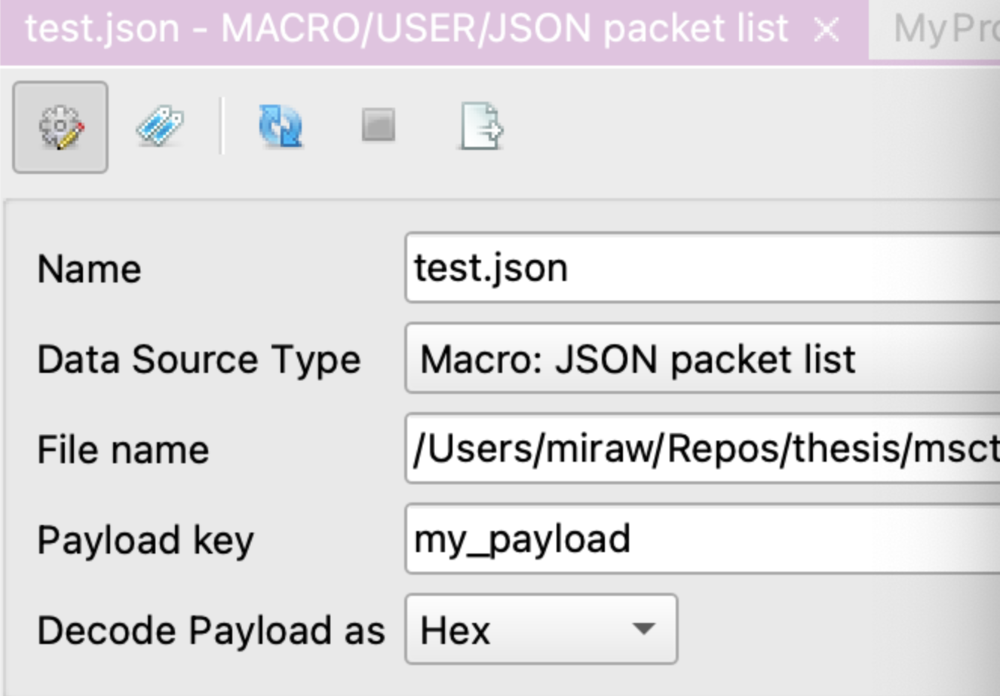
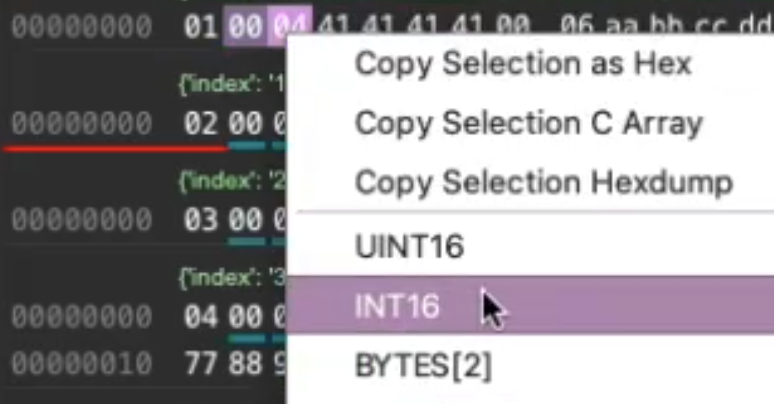
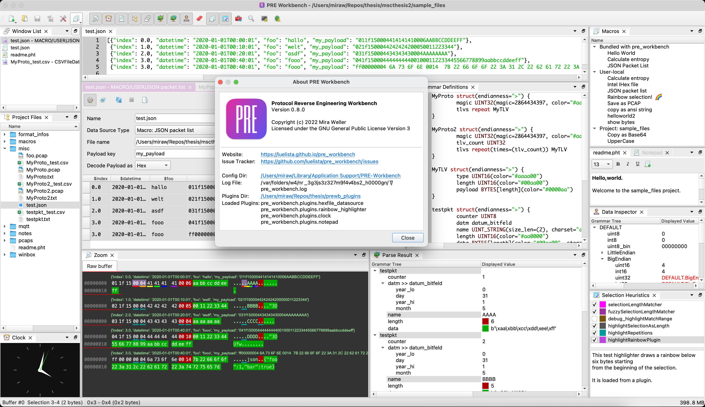

# Welcome to PRE Workbench Docs
PRE Workbench is a software that supports reverse engineers in analyzing proprietary binary protocols, using a **custom-built HEX viewer** for binary data and a specialized **[description language for binary protocol structures](syntax-reference.md)**. Our software supports verifying the documented structure with fast round-trip times as well as **[generating Wireshark dissectors](code-generation.md)** as output.

## Features

### Data import
- Load PCAP files
- Load binary files, single or a complete folder as package list
- Load CSV files, using one column as payload (hex/base64 encoded) and the rest as metadata

### Interactive Hexdump
#### Heuristics
- Recognize length fields
- highlight matching length fields for selection
- Evaluate selection as length field
- Highlight same content

#### Annotations
- color and text highlighting of byte sequences
- Application of the annotations to further packages

#### Interactive documentation of procotol structure as grammar
- Description language for binary protocols
- "Click-Grammar": Edit in parallel using code and GUI (see screencast below)
- Applying a grammar to multiple packages
- Display of fields from grammar in table

<blockquote class="imgur-embed-pub" lang="en" data-id="a/1t0hMp8"  ><a href="//imgur.com/a/1t0hMp8">PRE Workbench (Click-Grammar)</a></blockquote>

### Data inspector
Parse the selection as different data types (Signed/Unsigned Int, Big/Little Endian, ...).

### Search function and execution of external tools
Search one or multiple buffers for a regular expression, e.g. find all ASCII strings 5 byte or longer.

### Project folder
Preferences, widget layout, open files and grammars are stored per project.

### Plugin and macro support
Macros can be added at user-level (~/.config) and at project level (.pre_workbench), and some example macros are
bundled with the application -- to use macros, click "View" > "Tool Windows" > "Macros".
To enable plugin support, configure a plugin directory in the settings dialog. More information in the
[Plugins and Macros documentation](extending) and in the
[release notes](https://github.com/luelista/pre_workbench/releases/tag/0.7.8).
You can find some example plugins on [Github](https://github.com/luelista/prewb_example_plugins).

## Screenshot

