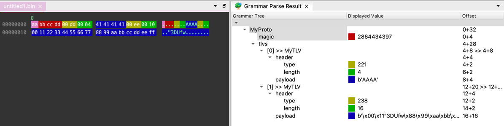

# Grammar Files
A grammar file consists of a map of names to type definitions, in the format `name1 definition1 name2 definition2 ...`, each element separated by white-space. The following sections explain all available base types from which the type definitions can be assembled.

```
grammar_file: field*
field: IDENTIFIER type
type: named | struct | repeat | variant | switch | union | bits

params: ("(" [parampair ("," parampair)*] ")")?
parampair: IDENTIFIER "=" value
```

# Example
The following grammar definition defines a simple protocol, with a magic number in the beginning of the packet,
followed by repeated TLV (type-length-value) items.
```

MyProto struct (endianness=">"){
	magic UINT32(magic=2864434397, color="#aa0000")
	tlvs repeat MyTLV
}

MyTLV struct {
	header struct {
		type UINT16(color="#aaaa00")
		length UINT16(color="#00aa00")
	}
	payload BYTES[header.length](color="#0000aa")
}
```

Parsing the following example data, consisting of the magic number and two TLV items, with MyProto from above grammar, gives us the results shown in the screenshot below:
```
00000000: AA BB CC DD 00 DD 00 04  41 41 41 41 00 EE 00 10  ........AAAA....
00000010: 00 11 22 33 44 55 66 77  88 99 AA BB CC DD EE FF  .."3DUfw........
```




# Parameters

Some parameters are recognized on all types, where the `params` element is accepted. Other parameters are recognized on 
specific types only, but can also be declared on any surrounding container type, causing them to cascade to the children
(e.g., declaring `endianness` on a struct specifies the endianness for all struct elements). 

| parameter | type | description |
| ------------- | ------- | --- |
| ignore_errors | Boolean | If true, all errors which may occur during parsing this element or it's children are ignored. |
| reassemble_into | list (Expression or string) |  |
| store_into | list (Expression or string) |  |
| segment_meta |  | experimental??? |
| hide |  | If specified, this field is hidden from the Grammar Parse Result tree view |


# Further Examples

For further examples, have a look at the test cases for the [parser](https://github.com/luelista/pre_workbench/blob/master/tests/test_grammar_parser.py) 
and [syntax](https://github.com/luelista/pre_workbench/blob/master/tests/test_grammar_code_syntax.py).

# Type Definitions

## named

```
named: IDENTIFIER params
```

In any place where a type is expected, a name can be used to reference another type defined in the same file. Many common types of integers, strings, floating-point numbers and network addresses are predefined. For easier adaption, they have the same name as in Wireshark dissectors.

This allows for generalization, because the same type can be references in multiple places (e.g. to define a common header shared by many different packet types). It also can make the grammar easier to read, because special cases can be put away at the end of the file, and the nesting depth can be reduced.
After the type name, parameters configuring parsing or visualization details can be provided in parentheses. This makes it possible to define more generic types, where e.g. the endianness is left open until the usage.

```
UINT32(endianness="<")
--> unsigned integer, 4 byte, little endian.

IPv4
--> IP version 4 address, in binary, in network byte order.

STRING[32](charset="utf-8")
--> character string in UTF-8 encoding, 32 bytes long

UINT_STRING(size_len=2, endianness=">", charset="utf-8")
--> character string in UTF-8 encoding, with an unsigned integer, 2 byte, big endian prefix specifing the string length.
  
mytype
--> custom type declared elsewhere
```


| parameter | type | description |
| ------------- | ------- | --- |
| endianness    | String  | "<" (Little endian) or ">" (Big endian). **Required** by some built-in named types (multibyte int and floats). |
| charset       | String  | [Python charsets, e.g. "utf-8"][charsets]. **Required** by all string types. |
| unit          | String  | "s", "ms", "us". Optional for ABSOLUTE_TIME, guessed if absent. |
| magic         | ???     | If specified, the field is only valid if its value matches the magic. |
| size          | int expression  | Optional for STRING and BYTES fields, the rest of the parsing unit is matched if absent. Short syntax: STRING[expr] |
| size_len      | int expression  | **Required** for UINT_STRING and UINT_BYTES |
| parse_with    | named   | Usually used on BYTES or UINT_BYTES fields, causes the value to be parsed as a child parsing unit. This allows to run the child parser with a fixed length, by specifying `size` or using UINT_BYTES. |


## struct
A struct is defined as an ordered list of named field definitions, where each field has a type.

```
struct: "struct" params "{" (IDENTIFIER type)* "}"
```


```
pascal_string struct {
	length UINT16(endianness=">")
	value STRING[length](charset="utf8")
}
# note: a pascal_string could be defined more easily using the UINT_STRING built-in, as shown above
```

If the name of a struct field starts with an underscore, it's contents will be collapsed in the tree view by default.


## repeat

```
repeat: "repeat" params type
```


```
int32_array struct(endianness=">") {
	count UINT16
	items repeat(times=(count)) INT32
}
```


| parameter | type | description |
| ------------- | ------- | --- |
| times       | int expression  |  |
| until       | int expression |  |
| until_invalid       | boolean  |  |


## variant

```
variant: "variant" params "{" type* "}"
```


```
capture_file variant {
	pcapng_file(endianness=">")
	pcapng_file(endianness="<")
	pcap_file(endianness=">")
	pcap_file(endianness="<")
}

```


## switch

```
switch: "switch" expression params "{" ("case" expression ":" type)* "}"
```


```
my_packet struct {
	header struct {
		type UINT8
	}
	payload switch (header.type) {
		case (1): payload_1
		case (2): payload_2
	}
}
```


## union

```
union: "union" params "{" (IDENTIFIER type)* "}"
```

```
u_s union {
	unsigned UINT16
	signed INT16
}
```


## bits

```
bits: "bits" params "{" (IDENTIFIER ":" number)* "}"
```

```
header bits(endianness="<") {
	TRX : 15
	res_1 : 1
	MID : 10
	res_2 : 2
	A : 1
	SEQ_hi : 3
	LEN : 15
	SEQ_lo : 8
	GROUP : 6
	res_3 : 3
}
```


| parameter | type | description |
| ------------- | ------- | --- |
| endianness    | String  | "<" (Little endian) or ">" (Big endian). |


# Expressions

TODO: describe expression syntax 

## Built-in functions

Currently, all functions have exactly one parameter.

| name    | description |
| ------- | ----------- |
| hex     | Returns a hex string representation of the parameter.   |
| dec     | Returns a decimal string representation of the parameter.   |
| dotted_quad | Returns a dot-separated decimal representation of the bytes passed as a parameter, like in an IPv4 address.   |
| ip6     | Returns a colon-separated hexadecimal representation, like in an IPv6 or Ethernet address.   |
| dec     | Returns a decimal string representation of the parameter.   |
| len     | Returns the length of the parameter.  |
| snip    | Truncates the parameter to 32 bytes, if longer. |
| pad     | Returns the number of bytes required to pad the current buffer to a multiple of N bytes. |


[charsets]: <https://docs.python.org/3/library/codecs.html#standard-encodings>
